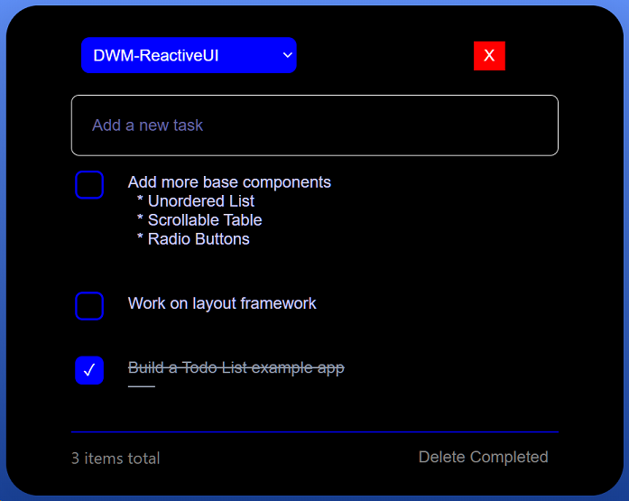
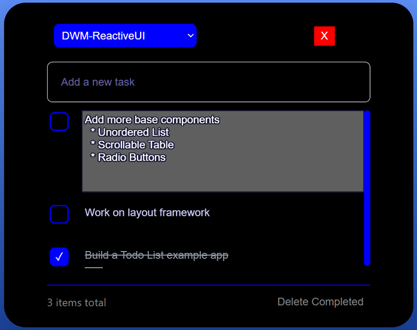
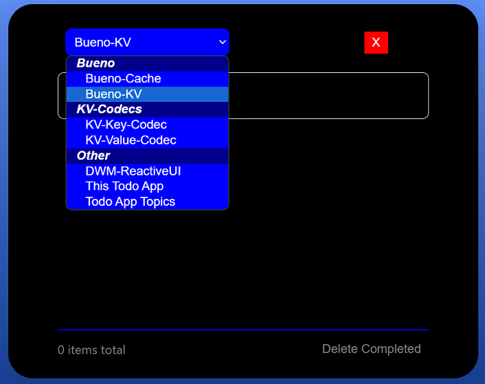
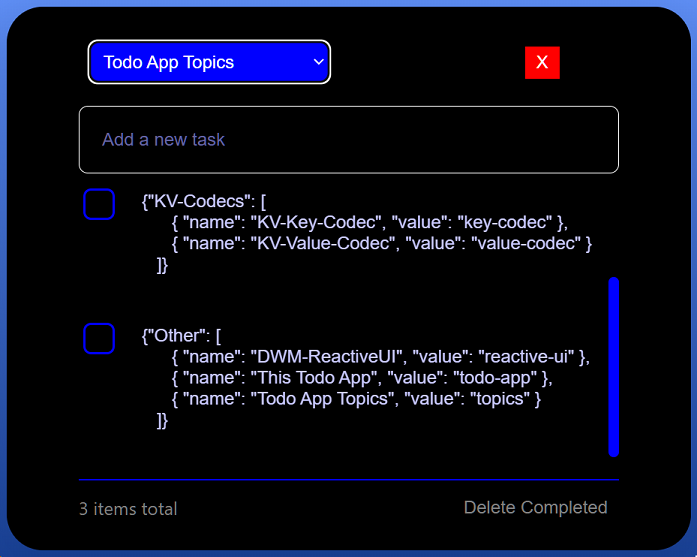

## Todo List App

This simple app allows me to organize Todo-Tasks by subject and project.    
I've used a simple selectBox to select projects from Select-Groups.    
Once selected, all tasks for that project are listed. 
You can add a task for the current project by entering text in the task input.    
Clicking on a task, allows you to edit its text in a multi-line TextArea element.    

## Note: 
The following link connects to my personal todo-kvDB on Deno Deploy.    
You can try all features, but no mutations will be persisted with this Guest-link.   
### Try it:  https://nhrones.github.io/KV-Todo/

 

## Tasks
To add a task, just type in the textInput and press enter.    
To edit a task, just click on it.     
An editable multiline TextArea will allow in place edits.    
All edits are auto-saved on 'blur'.

Each task has a `completed` checkBox.    
The `Delete Completed` button on the bottom-right will delete any checked tasks.    

 

## Todo Topics
The dropdown box shows all current option groups and todo topics.    
These are configurable by the user; see below.    
The image above shows the `DWM-ReactiveUI` topic selected with it's current task list.    

 

## Configurable Topics
Note, the `Topic-Select-List` is configurable directly in the app. Just select `Todo App Topics`        
in the drop-down, and then click on the json-text to edit it. Changes will show on tab refresh.   

This version uses localStorage.  I'll be _Deploying_ a version for DenoKv.    

If something breaks, you can delete the localStorage file, and a blank template will auto install on next start.     
See: ./selections.js/

## Deno Desktop App
I started this project as a DWM-ReactiveUI app.     
I liked the look-and-feel of my Deno-Desktop version so much, that I spent time creating this HTML version.   
Building this HTML version was very difficult for me as I have limited CSS experience.    

## Have Fun! Make a copy and clean up my clumsy code.